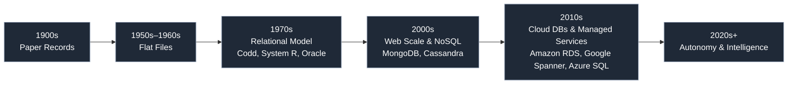

# 🗓️ Day 13: Introduction to Databases

Welcome to Day 13! This session lays the groundwork you’ll use throughout the course. You’ll learn what databases are, why we use them, and key concepts that underpin how we store and query data.

---

### 🎯 Goals

- Understand what a database is and common database types
- Learn core relational concepts: tables, rows, columns, keys, relationships
- Grasp ACID transactions and why they matter
- Get a high-level view of SQL vs. NoSQL trade-offs
- See how databases evolved over time

---

### 📘 What is a Database?

A database is an organized collection of data that supports efficient storage, retrieval, and management. A Database Management System (DBMS) provides tooling and guarantees (e.g., transactions, durability) over that data.

- Relational DBMS (RDBMS): PostgreSQL, MySQL, SQL Server, Oracle
- Non-relational (NoSQL): Key-Value (Redis), Document (MongoDB), Columnar (Cassandra), Graph (Neo4j)

---

### 🧱 Relational Core Concepts

- Tables, rows, columns (relations, tuples, attributes)
- Primary key (row identity) and foreign key (relationship link)
- Normalization basics (1NF, 2NF, 3NF) to reduce redundancy
- Joins to combine related tables

---

### 🔒 Transactions and ACID

- Atomicity: All-or-nothing
- Consistency: Valid state transitions
- Isolation: Concurrent transactions don’t interfere
- Durability: Once committed, data persists

---

### 🗃️ SQL vs. NoSQL (high level)

- SQL: Structured schema, strong consistency, powerful joins/transactions
- NoSQL: Flexible schema, scale-out patterns, often eventual consistency
- Modern platforms frequently mix both depending on workload

---

### 🧭 Database Evolution

The diagram below summarizes the major eras (inspired by the “Evolution of Databases” image you’ve seen). Use it as a mental map; exact dates vary by source and vendor timelines.



Key highlights:

- 1900s: Paper files—slow, error-prone
- 1950s–60s: Flat files—simple text/binary files, limited relationships
- 1970s: Relational model revolutionizes data management (SQL emerges)
- 2000s: Internet scale drives NoSQL for un/semistructured data and horizontal scaling
- 2010s: Cloud-managed databases improve availability and operations
- 2020s+: Smarter, more autonomous databases and ML-assisted operations

---

### ✅ What You’ll Need Next

- A running PostgreSQL instance (we’ll use Docker in this repo)
- A SQL client (psql, SQLPad, pgAdmin, or your IDE)

---

### 📂 Structure for Day 13

- `examples/`
  - `ddl.sql`: DDL examples (CREATE/ALTER/DROP/TRUNCATE/INDEX) using dvdrental
  - `dml.sql`: DML examples (INSERT/UPDATE/DELETE/SELECT/UPSERT) wrapped in ROLLBACK
  - `column_types.sql`: Postgres types (CHAR/VARCHAR/TEXT/INTEGER/NUMERIC/BOOLEAN/DATE/TIMESTAMPTZ/INTERVAL)
  - `materialization.sql`: CTE, derived tables, temp tables, UNLOGGED, views, materialized views
- `exercises/`
  - `exercises.sql`: Tasks covering DDL, DML, types, and materialization
- `answers/`
  - `exercises.sql`: Reference solutions

All examples target the dvdrental dataset that ships with this repo’s Docker setup.

### ▶️ How to run

Using psql:

```bash
# from repo root, assuming dvdrental Postgres is up
psql \"$POSTGRES_URL\" -f day_13/examples/ddl.sql
psql \"$POSTGRES_URL\" -f day_13/examples/dml.sql     # auto-ROLLBACK to avoid data changes
psql \"$POSTGRES_URL\" -f day_13/examples/column_types.sql
psql \"$POSTGRES_URL\" -f day_13/examples/materialization.sql
```

For exercises:

```bash
psql \"$POSTGRES_URL\" -f day_13/exercises/exercises.sql
```

If you want to see reference answers:

```bash
psql \"$POSTGRES_URL\" -f day_13/answers/exercises.sql
```

Proceed to Day 15 for hands-on SQL using the dvdrental dataset.
