# Practical Module Day 14: Basic and Intermediate SQL Queries

## 🧭 Overview

This module focuses on DML with emphasis on advanced `SELECT` usage:

- Filtering and advanced filtering (`WHERE`, `IN`, `BETWEEN`, `LIKE`, `IS NULL`)
- Aggregation and grouping (`COUNT`, `SUM`, `AVG`, `GROUP BY`, `HAVING`)
- Conditional logic (`CASE WHEN`, `COALESCE`, `GREATEST`, `LEAST`)
- Joins (`INNER`, `LEFT`, `RIGHT`, `FULL OUTER`, `CROSS`)
- Combining results (`UNION`, `UNION ALL`)

## 📂 Structure

- `examples/`
  - `filtering.sql`: Filtering, advanced filtering, ordering, limiting
  - `aggregation.sql`: Aggregates, grouping, `HAVING`, time bucketing
  - `conditional.sql`: `CASE WHEN`, `COALESCE`, `GREATEST`/`LEAST`
  - `joins.sql`: `INNER JOIN`, `LEFT JOIN`, `RIGHT JOIN`, `FULL OUTER JOIN`, `CROSS JOIN`
  - `union.sql`: `UNION ALL` vs `UNION`
- `exercises/`
  - `exercises.sql`: Tasks covering all topics above
- `answers/`
  - `exercises.sql`: Reference solutions

## 💾 Dataset

This module now uses dvdrental (PostgreSQL sample). Key tables:

- `film`, `category`, `film_category`
- `customer`, `address`, `city`, `country`
- `payment`

## ▶️ How to run

Using psql (ensure your database URL is exported as `$POSTGRES_URL`):

```bash
psql "$POSTGRES_URL" -f day_14/examples/filtering.sql
psql "$POSTGRES_URL" -f day_14/examples/aggregation.sql
psql "$POSTGRES_URL" -f day_14/examples/conditional.sql
psql "$POSTGRES_URL" -f day_14/examples/joins.sql
psql "$POSTGRES_URL" -f day_14/examples/union.sql
```

Exercises:

```bash
psql "$POSTGRES_URL" -f day_14/exercises/exercises.sql
```

Answers:

```bash
psql "$POSTGRES_URL" -f day_14/answers/exercises.sql
```

# 🗓️ Day 14: Introduction to Databases

Welcome to Day 14! This session lays the groundwork you’ll use throughout the course. You’ll learn what databases are, why we use them, and key concepts that underpin how we store and query data.

---

### 🎯 Goals

- Understand what a database is and common database types
- Learn core relational concepts: tables, rows, columns, keys, relationships
- Grasp ACID transactions and why they matter
- Get a high-level view of SQL vs. NoSQL trade-offs
- See how databases evolved over time

---

### 📘 What is a Database?

A database is an organized collection of data that supports efficient storage, retrieval, and management. A Database Management System (DBMS) provides tooling and guarantees (e.g., transactions, durability) over that data.

- Relational DBMS (RDBMS): PostgreSQL, MySQL, SQL Server, Oracle
- Non-relational (NoSQL): Key-Value (Redis), Document (MongoDB), Columnar (Cassandra), Graph (Neo4j)

---

### 🧱 Relational Core Concepts

- Tables, rows, columns (relations, tuples, attributes)
- Primary key (row identity) and foreign key (relationship link)
- Normalization basics (1NF, 2NF, 3NF) to reduce redundancy
- Joins to combine related tables

---

### 🔒 Transactions and ACID

- Atomicity: All-or-nothing
- Consistency: Valid state transitions
- Isolation: Concurrent transactions don’t interfere
- Durability: Once committed, data persists

---

### 🗃️ SQL vs. NoSQL (high level)

- SQL: Structured schema, strong consistency, powerful joins/transactions
- NoSQL: Flexible schema, scale-out patterns, often eventual consistency
- Modern platforms frequently mix both depending on workload

---

### 🧭 Database Evolution

The diagram below summarizes the major eras (inspired by the “Evolution of Databases” image you’ve seen). Use it as a mental map; exact dates vary by source and vendor timelines.

```mermaid
flowchart LR
  A["1900s<br/>Paper Records"] --> B["1950s–1960s<br/>Flat Files"]
  B --> C["1970s<br/>Relational Model<br/>Codd, System R, Oracle"]
  C --> D["2000s<br/>Web Scale & NoSQL<br/>MongoDB, Cassandra"]
  D --> E["2010s<br/>Cloud DBs & Managed Services<br/>Amazon RDS, Google Spanner, Azure SQL"]
  E --> F["2020s+<br/>Autonomy & Intelligence"]

  %% Notes
  classDef era fill:#1f2937,stroke:#94a3b8,color:#fff,stroke-width:1px;
  class A,B,C,D,E,F era;
```



Key highlights:

- 1900s: Paper files—slow, error-prone
- 1950s–60s: Flat files—simple text/binary files, limited relationships
- 1970s: Relational model revolutionizes data management (SQL emerges)
- 2000s: Internet scale drives NoSQL for un/semistructured data and horizontal scaling
- 2010s: Cloud-managed databases improve availability and operations
- 2020s+: Smarter, more autonomous databases and ML-assisted operations

---

### ✅ What You’ll Need Next

- A running PostgreSQL instance (we’ll use Docker in this repo)
- A SQL client (psql, SQLPad, pgAdmin, or your IDE)

Proceed to Day 15 for hands-on SQL using the dvdrental dataset.
